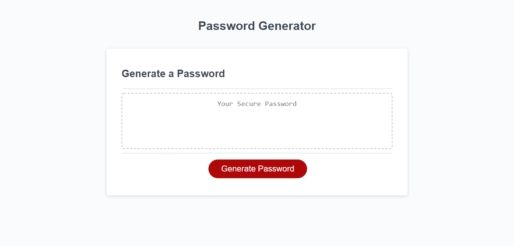

# Password Generator

## Goals

The goal of this assignment was to create a password generator that would take 

user inputs and randomly generate a password from them. The inputs include a 

character limit from 8 to 128 that only accepts numbers, and whether the user 

would like to include any of the following: lowercase letters, uppercase letters, 

numbers, and special characters. The randomly generated password is then displayed

in the box on the screen. Clicking the generate button again will take the user to

the beginning of the generation process. A screenshot and link to the application

are provided below.

